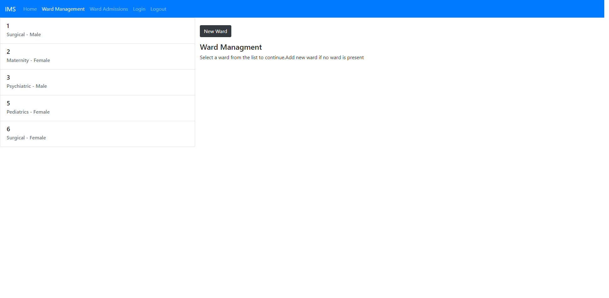

# User Guide - Inward Management System

## Login

User needs to login to the system in order to consume the resources of the system. User needs to be registered in the system.

## Ward Management
Ward management involves adding, updating and removing wards. Given below is the main user interface for ward management and could be accesed by using the navigator entry.

### Add Ward
To add a ward press the _New Ward_ and it will popup a modal dialog where relevant information can be entered. Once the information is filled, press _Add_ to add the ward. You can keep on adding wards or pres _Close_ to return to the Ward Management page.

### Ward Information
List of wards are shown in the screen which can be selected to show the ward information.

The ward information includes the beds of that ward. These are shown in a table.

### Add Bed

You can also add a bed to your ward using the _New Bed_ button. This will popup a modal dialog. You can continue to add multiple beds or return to the Ward management winow by closing the modal dialog using the _close_ button.

## Ward Admissions

Ward admissions windows displays all the admissions for all wards.

